# monet-niri
niri with matugen themed gtk and qt apps

𝕔𝕝𝕚𝕔𝕜 𝕥𝕠 𝕧𝕚𝕖𝕨 𝕤𝕔𝕣𝕖𝕖𝕟𝕤𝕙𝕠𝕥𝕤

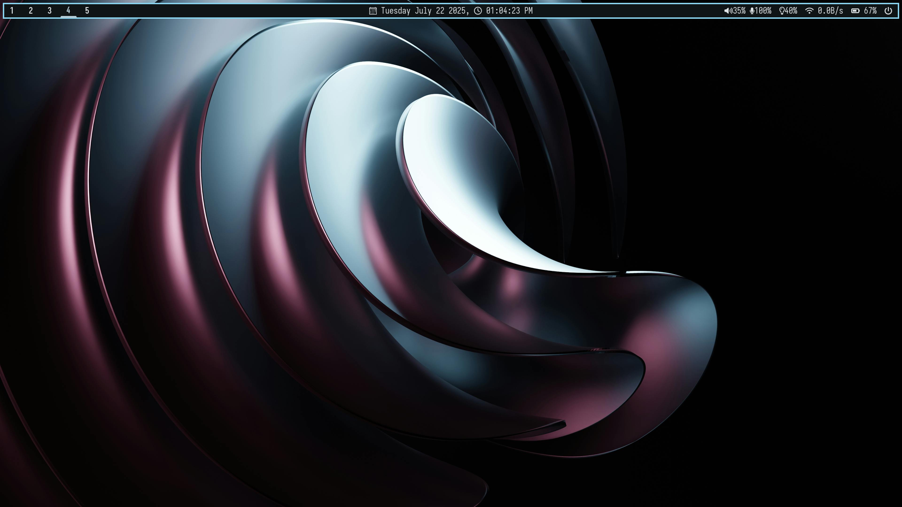
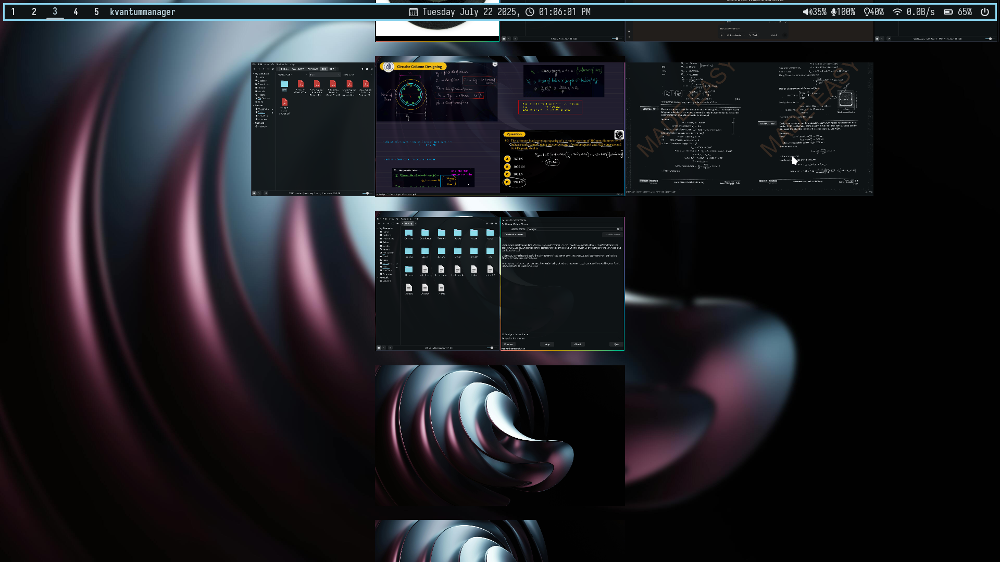
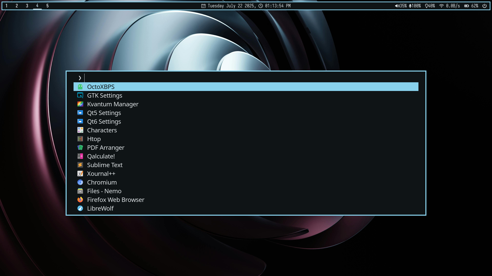
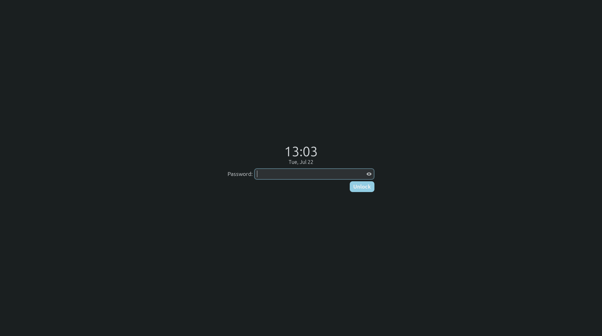
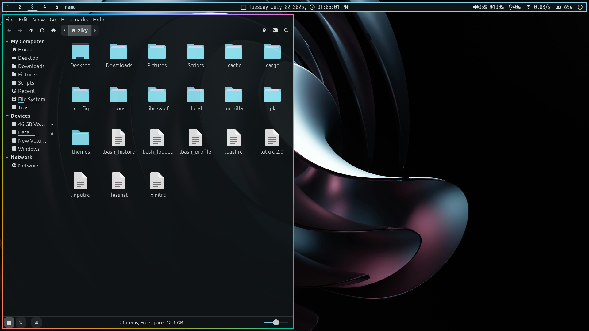

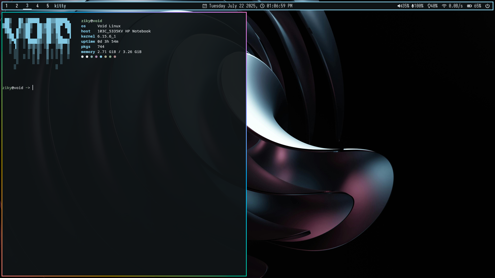
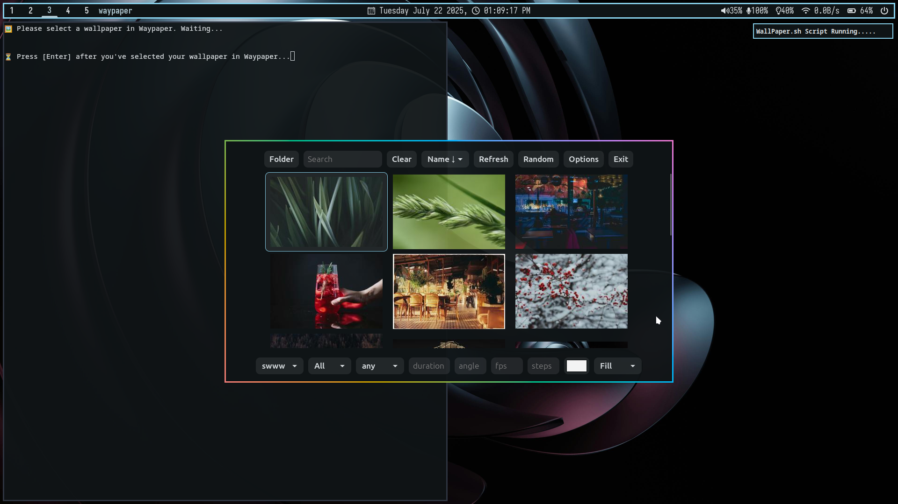
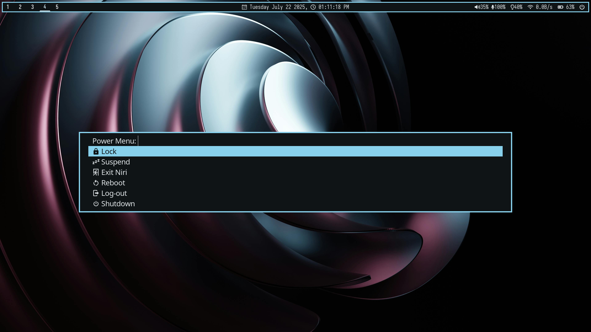
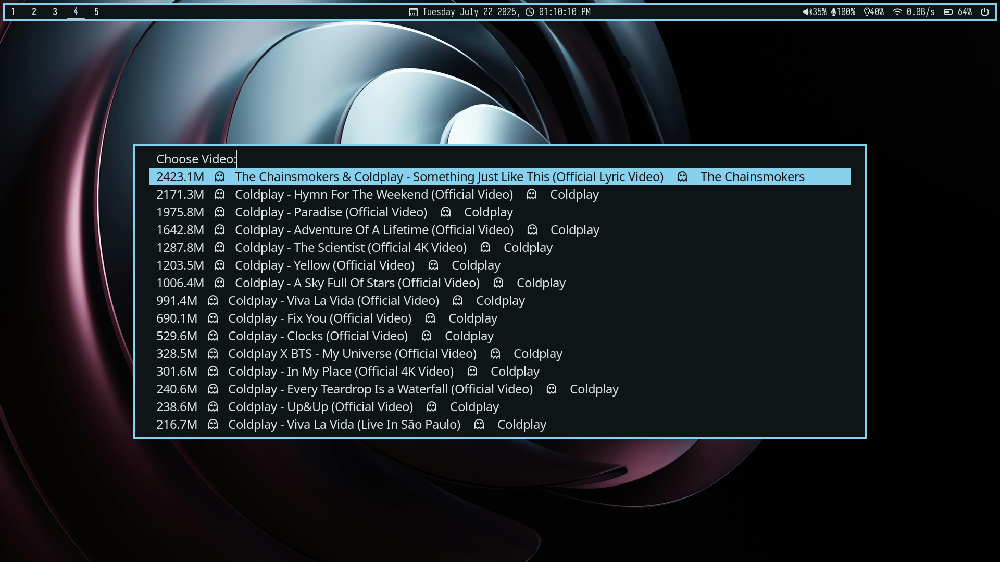
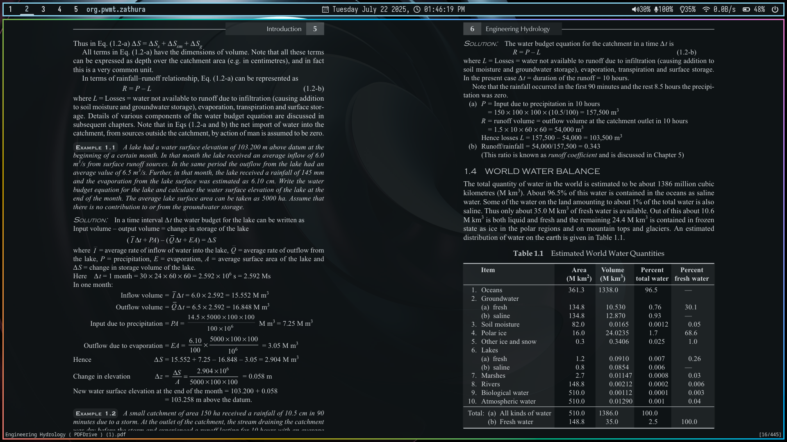
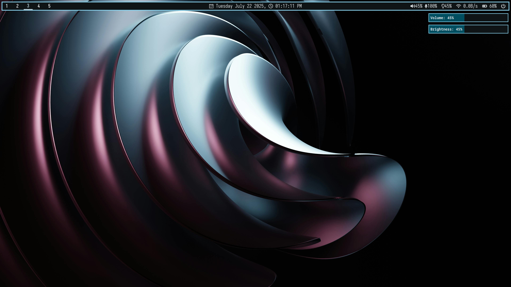

Things Used from others

[Papirus Folder Colors Script copied from elrondforwin and modified](https://github.com/elrondforwin/hyprdots)
[Kvantum Theme is based on vinceliuice Orchis-kvantum](https://github.com/vinceliuice/Orchis-kde)
[Gtk theme is adw-gtk3](https://github.com/lassekongo83/adw-gtk3)
[matugen for color-pallete](https://github.com/InioX/matugen)
[wallpapers are from pexels](htttps://pexels.com)
sorry, if i missed someone here.

## How to use these?
1) copy .config to $HOME/.config
2) copy .themes to $HOME/.themes
3) copy .local/share/icons to $HOME/.local/share/icons
4) copy Pictures/Wallpapers to $HOME/Pictures/Wallpapers/
5) copy Scripts to $HOME/Scripts

### check all keybindings from niri config.kdl
Mod+A => Wallpaper + matugen setter (need waypaper, swww, swaybg)

